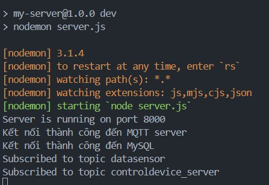
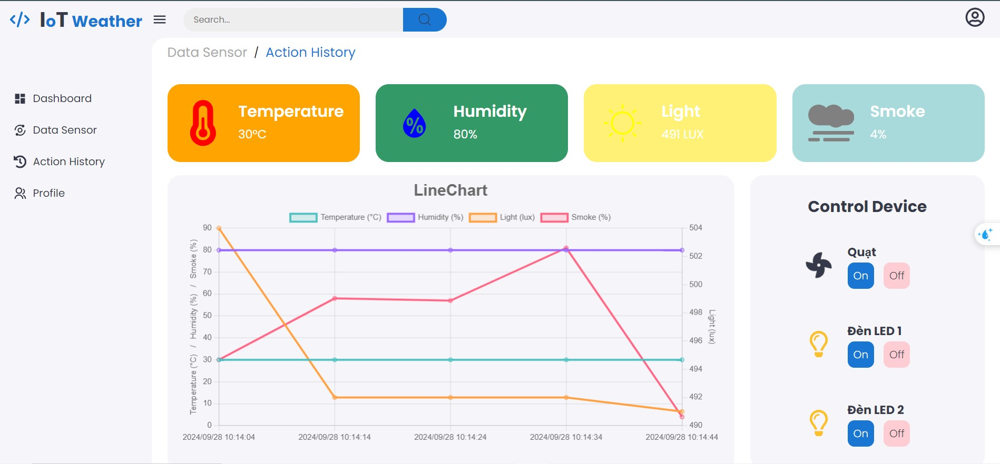
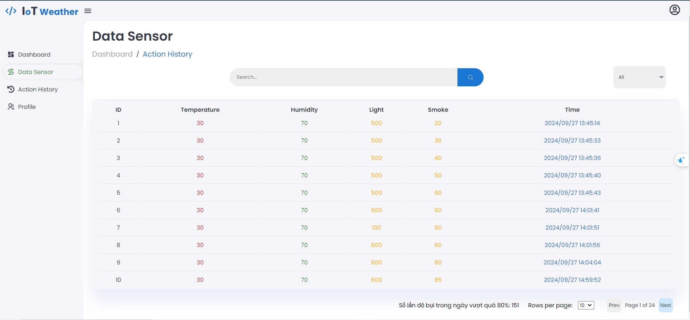
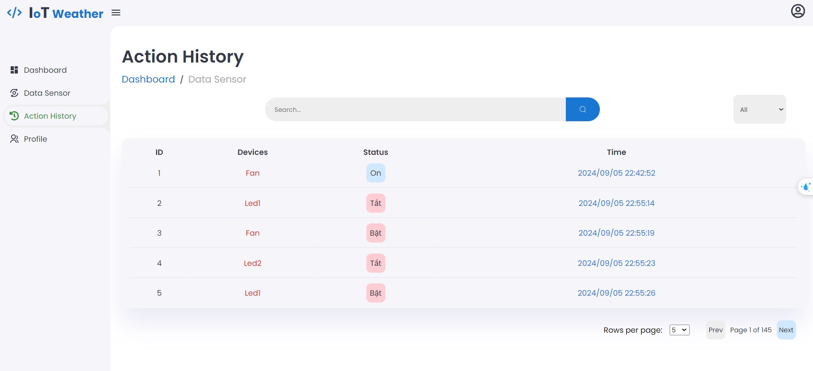
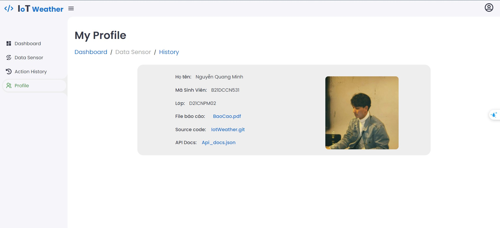

# Web IoTWeather Project

## Giới thiệu
Dự án này là một hệ thống IoT cho phép giám sát nhiệt độ, độ ẩm, ánh sáng,... và điều khiển các thiết bị như quạt, bóng đèn, điều hòa,.. thông qua giao thức MQTT. Hệ thống bao gồm:

- **Arduino**: Điều khiển phần cứng như cảm biến và các thiết bị thông qua MQTT.
- **FrontEnd**: Sử dụng ReactJs để hiển thị dữ liệu real-time và điều khiển các thiết bị.
- **Backend**: Sử dụng NodeJS và ExpressJS để xử lý dữ liệu từ Arduino gửi đến và thực hiện các yêu cầu từ phía Frontend.
- **Database**: Sử dụng MySQL để lưu trữ dữ liệu.
- **MQTT**: Sử dụng để pub/sub dữ liệu giữa các thiết bị và hệ thống.

## Cài đặt và chạy dự án
### 1. Cài đặt các package

#### Frontend (ReactJS)
- Mở Command Prompt
- Chạy lệnh `cd my-client`
- Chạy lệnh `npm install` để cài đặt các dependencies trong tệp `package.json`

#### Backend (NodeJS)
- Mở Command Prompt
- Chạy lệnh `cd my-server`
- Chạy lệnh `npm install` để cài đặt các dependencies trong tệp `package.json`

### 2. Chạy dự án

#### Backend (NodeJS)
- Mở Command Prompt
- Chạy lệnh `cd my-server`
- Chạy lệnh `npm run dev` để khởi động Server
- Sau khi khởi động, đây là kết quả trên Terminal

#### Frontend (ReactJS)
- Mở Command Prompt 
- Chạy lệnh `cd my-client`
- Chạy lệnh `npm start` để khởi động 
- Sau khi khởi động, đây là giao diện Web nhận được

